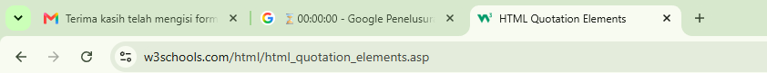
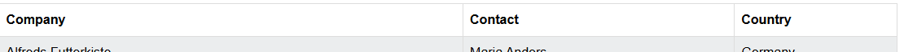
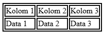
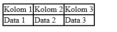
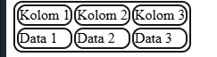
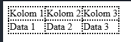
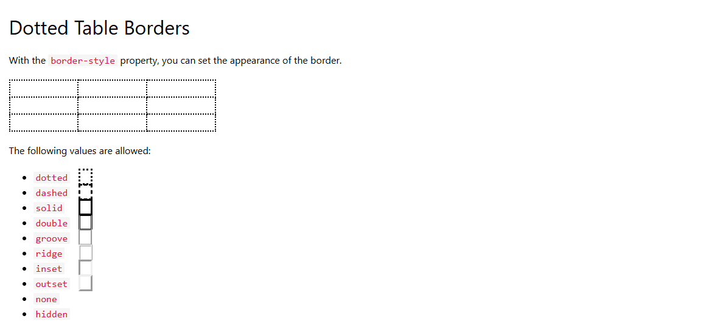
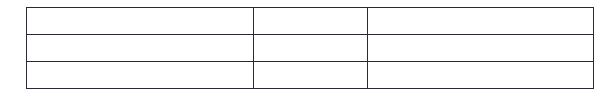
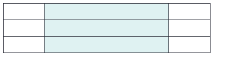

# Belajar-Html


## Note
1. Elemen Di Html Punya Format ```<tag>kontent</tag>```.
- ```<tag>``` Di Sebut Opening Tag Dan ```</tag>``` Di Sebut Closing Tag.
- Elemen Adalah Bagian Dari Html Yang Menyusun,Struktur Dan Konten, Yang Terdiri Dari ```Opening Tag, Isi Dan Closing Tag```.

<br>
<br>

2. Atribut Adalah Kemampuan Yang Menempel Di Elemen Tepat Nya Di Opening Tag Yang Berfungsi Menambahkan Kemampuan Kepada Elemen Mau Itu Wajib Atau Tidak Wajib.
- ```<tag atribut="nilai">isi</tag>```.

<br>
<br>


## Heading
- Heading Adalah Elemen Html Yang Digunakan Untuk Membuat Judul Dan Sub Judul
- Maksud nya Sub Judul Dan Judul Adalah Seperti Ini


<br>
<br>
<br>
<br>

# INI JUDUL ```<h1>```
## INI SUB JUDUL ```<h2>```
### INI SUB JUDUL ```<h3>```
#### INI SUB JUDUL ```<h4>```
##### INI SUB JUDUL ```<h5>```
###### INI SUB JUDUL ```<h6>```
<br>
<br>
<br>
<br>
- Heading Terdiri Dari H1 -> H6 Semakin Besar Angkanya Semakin Kecil Headingnya

<br>
<br>

## Paragraf
- Paragraf Adalah sekumpulan kalimat yang ngebahas satu ide/topik, terus dipisahin dari kumpulan kalimat lain (paragraf lain) pake jarak atau baris baru.
- ```<p>``` Untuk Membuat Sekumpulan Teks Atau Kalimat
- ```<hr>``` Untuk Membuat Garis Pisah
- ```<br>``` Untuk Membuat Baris Baru
- ```<pre>``` Untuk Membuat Paragraf Sama Persis Dengan Apa Yang Dituliskan 
- Misal Kalo :
```
<pre>
Haloo Gak Jelas
ga
        Hai
</pre>
```
<br>
- Maka Outputnya Akan Sama Seperti Ini

<br>

```
Haloo Gak Jelas
ga
        Hai

```

<br>


## Formating
```formatting``` di HTML itu cara lo ngasih "gaya" atau penekanan khusus ke teks, biar teksnya nggak flat-flat aja. Jadi ini beda sama heading atau paragraf yang lebih ke struktur — formatting ini lebih ke "bagian teks ini gw mau bikin beda".

<br>

- Btw Ini Elemen elemen Nya


<br>
 
- ```<b>``` -> Untuk Membuat Teks Berbentuk Bold
- ```<strong>``` -> Untuk Membuat Teks Berbentuk Bold
- ```<small>``` -> Untuk Membuat Teks Berbentuk Kecil
- ```<i>``` -> Untuk Membuat Teks Berbentuk <i>Italic</i>
- ```<em>``` -> Untuk Membuat Teks Berbentuk <i>Italic</i>
- ```<mark>``` -> Untuk Membuat Teks Berbentuk <mark>Marked</mark>
- ```<del>``` -> Untuk Membuat Teks Berbentuk <del>Deleted</del>
- ```<ins>``` -> Untuk Membuat Teks Berbentuk <ins>Inserted</ins>
- ```<sub>``` -> Untuk Membuat Teks Berbentuk <sub>Subscript</sub> Contoh : O<sub>2</sub>

<br>

- ```<sup>``` -> Untuk Membuat Teks Berbentuk <sup>Superscript</sup> Contoh H<sup>2o</sup>

<br>


- ```<del>``` -> Untuk Membuat Teks Berbentuk <del>Deleted</del>


<br>

## Quotation
6. ```Quotation``` = kutipan. Artinya lo ngambil/nyalin ucapan atau tulisan dari sumber lain, terus lo taro di dalam konten lo, biasanya dikasih tanda khusus biar jelas itu bukan kata-kata lo sendiri.

<br>

- Berikut Adalah Elemen Elemenya


<br>

- ``` <blockquote> ``` -> Secara Visual Akan Menambahkan Tab Pada Paragraf Atau pun Heading
- ``` <q> ``` -> Secara Visual Akan Menambahkan Tanda Kutip Pada Teks ```"```
- ``` <abbr> ``` Secara Visual Akan Menambahkan Sebuah Teks Ketika Di Hover
- ```<address> ``` Secara Visual Akan Membuat Font Menjadi Italic<address> Alamat </address>
- ``` <cite>``` Secara Visual Akan Membuat Font Menjadi Italic<cite> Sumber </cite>


## Link
- link Adalah Sebuah Elemen Yang Berisi Url Atau Alamat Atau Resource , Yang Terkandung Dalam Isi ```<a href="#">Isi Ini</a>```

#### Cara Bikinnya 
- ```<a>``` Anchor Sebuah Elemen Yang Bisa Diklik
- ``` href="" ``` Adalah Sebuah Atribut Wajib Isinya Alamat ,Tujuan(Url Atau Path) Ini Bisa Diartikan Sebagai Target Tujuan.


#### Atribut ```href=""``` bisa Mengarahkan Dengan Cara Berikut

#### 1.Link Ke Website Luar (Bukan Local)

```
<a href="https://www.baidu.com">Baidu</a>
```
#### 2.Link Ke Halaman Lain Local

```
<a href="halaman.html">Home</a>
```
#### 3. Link Mengarahkan Ke Bagian Tertentu (Misal ke H1)
```
<a href="#elemen1">Ke Elemen 1</a>


<h1 id="elemen1">Elemen 1</h1>
```

#### 4.Mengarahkan Ke Email, Pake : mailto:

```
<a href="mailto:aini@example.com">Kirim Email</a>
```
#### 5.Mengarahkan Ke No Telp , Pake tel:

```
<a href="tel:+62822167899">No Telp Gw</a>
```

### Atribut Lain Yang Berguna ```Support Atribut ```

#### Target
- Target = "_blank" -> ```Buka Tab Baru```
- Target = "_self" -> ```Buka  Di Tab Yang Sama```
- Target = "_Parent" -> ```Buka Tab Yang Parent```

#### Download
- Bikin Link JAdi Trigger Download Bukan Navigasi Halaman

```
<a href="file.pdf" download>Download Pdf</a>

Or

<a href="file.pdf" download="nama.pdf"> Pdf Donwload </a>
```

## Image 
Image adalah Sebuah elemen Untuk Menampilkan Sebuah Gambar DI Halaman Html

#### Note Img Itu Self Closing Jadi Ga Punya Closing Tag

- img Punya Atribut Wajib Yaitu ```Src=""``` Atau ```Source```
- src Adalah Sebuah Atribut Yang Menyediakan Url Atau Path Tempat Gambar Yang Ingin Ditampilkan

### Cara Memakai Atribut Src Sebagai Berikut

#### 1.Kalo Di Satu Folder Yang Sama

```

```
#### 2.Kalo Beda Folder 

```

```
#### 3.Ini Dari Website Luar Bukan Local

```

```

### Atribut Pendukung Nya Sebagai Berikut
Ada Atribut Pendukung Untuk Membuat elemen Image Mendapat Kemampuan ```Pada Load Imagenya```


- #### Alt = Teks Alternatif Ketika Image Gagal Load


## Favicon
Favicon Adalah Sebuah Icon Kecil Muncul Di Tab Browser . Biasanya  
Logo Mini Situs 



#### Cara Mengisi Favicon Pada Tab Adalah Sebagai Berikut
```
<head>
   <link rel="icon" href="image.png">
</head>
```

## Title 
Tittle Adalah Sebuah Teks Yang Berada Di Samping Ikon Kecil ```Favicon```

#### Cara Membuat 

```
<head>
    <title>Ini Judul</title>
</head>
```


## Table
Table Adalah Sebuah Elemen Untuk Membuat Susunan Informasi Yang Dipisahkan Oleh Baris Dan Kolom

### Referensi :
- ```<table>``` Tag Ini Memberi Tahu pada Html . Bahwa Saya Ingin Membuat Tabel
- ```<tr>``` Tag Ini Untuk Membuat Baris Baru
- ```<th>``` Tag Ini Untuk Header Table Biasanya Seperti Ini (Lebih Tebal)

- ```<td>``` Tag Ini Untuk Kolom Table( Biasanya Berisi Data)
- ```<caption>``` Tag Ini Untuk Menambahkan Judul Pada Tabel

Coba Kita Liat Mana Itu Caption

<hr>

<table>

 <caption>Daftar nama Siswa</caption>
  <tr>
    <th>Person 1</th>
    <th>Person 2</th>
    <th>Person 3</th>
  </tr>
  <tr>
    <td>Emil</td>
    <td>Tobias</td>
    <td>Linus</td>
  </tr>
  <tr>
    <td>16</td>
    <td>14</td>
    <td>10</td>
  </tr>
</table>

<hr>
nah Daftar Nama Siswa Adalah Caption. Biasa nya Berada Di Atas

<br>

- ``` <colgrup> ``` adalah elemen HTML untuk mengelompokkan kolom dalam tabel, sehingga Anda bisa menerapkan style atau properti ke beberapa kolom sekaligus tanpa harus ngasih atribut ke setiap sel satu per satu.

#### Pengggambarannya :

<hr>

<table>
  <colgroup>
    <col style="background-color: white">
    <col span="2" style="background-color: white">
  </colgroup>
  <tr>
    <td>Kolom 1</td>
    <td>Kolom 2</td>
    <td>Kolom 3</td>
  </tr>
  <tr>
    <td>Data 1</td>
    <td>Data 2</td>
    <td>Data 3</td>
  </tr>
</table>


<hr>

- ```<col>``` Adalah Sebuah Elemen Untuk Menargetkan Kolom Tabel Mana yang Akan Di Styling. Penargetannya Adalah Dengan Berurutan. col ke 1 Mengatur kolom ke 1, col ke 2 Mengatur kolom Ke 2.
- ```#``` Note Untuk Membuat Tag ```<col>``` Bisa Styling 2 Atau Lebih Kolom Sekaligus Maka Gunakan Atribut 
```
span="(Berapa Banyak tabel yang Mau Di Styling)"
```
<hr>

- Contoh
```span="2"``` Menargetkan 2 Kolom Sekaligus!!

- Nah Tapi Kalo Mau Lebih Terstruktur Dan Jelas Gunakan

1. ```<thead>``` Untuk Membuat Header Table
2. ```<tbody>``` Untuk Membuat Body Table
3. ```<tfoot>``` Untuk Membuat Footer Table

#### Contoh

<table border="1">
  <caption>Daftar Nilai</caption>
  
  <!-- Header Tabel -->
  <thead>
    <tr>
      <th>Nama</th>
      <th>Matematika</th>
      <th>Bahasa Indonesia</th>
    </tr>
  </thead>
  
  <!-- Isi Tabel -->
  <tbody>
    <tr>
      <td>Andi</td>
      <td>85</td>
      <td>90</td>
    </tr>
    <tr>
      <td>Budi</td>
      <td>78</td>
      <td>82</td>
    </tr>
  </tbody>
  
  <!-- Footer Tabel -->
  <tfoot>
    <tr>
      <td>Rata-rata</td>
      <td>81.5</td>
      <td>86</td>
    </tr>
  </tfoot>
</table>

Memang Kelihatan Sama Tapi Ini Lebih Mudah Dimengerti

### Note :
 Jadi Jika Ingin Membuat Lebih Dari 3 Baris Maka Bisa Menggunakan ```<tbody>``` Lebih Dari Satu!!

 ..


<br>
<br>


# Styling Pada Table Menggunakan CSS
Kali Ini KIta Akan Melakukan Gimana Css Merubah Bentuk Table


## BORDER
Border Adalah Sebuah Batas Yang Di Definisikan Oleh Sebuah Tag Css Yang Membuat Elemen Html Mempunyai ```Batas```

### Cara Menambahkan Border Pada Tabel
#### Output :



<br>

```
<table id="border-1">
  <tr>
    <td>Kolom 1</td>
    <td>Kolom 2</td>
    <td>Kolom 3</td>
  </tr>
  <tr>
    <td>Data 1</td>
    <td>Data 2</td>
    <td>Data 3</td>
  </tr>
</table>
<style>
  #border-1, td {
    border: 2px solid white;
  }
</style>
```

### Batas Table Double Yang Dihilangkan 

Nah Supaya Border Nya ITU Gak ```Nyelimutin``` Cell Nya Atau Bordernya Kayak Gitu Maka Gunakan ```border-Collapse```

#### Output



<br>

```
  #border-1, td {
    border: 2px solid white;
    border-collapse: collapse;
  }
```


### Memberikan Radius Pada Border

#### Output:


<br>

```
  #border-1, td {
    border: 2px solid white;
    border-radius: 10px;
  }
```

### Menambahkan Style Border


#### Output:



```
 th, td {
  border-style: dotted;
}
```

### Nilai Yang Bisa Diisi Dengan ```Border-Style```



## UKURAN PADA TABLE 
Table Bisa Diatur Ukurannya. Jika Ingin Gampang Ke Gini
- Jika Maunya Ngatur Ukuran ```<table>``` Doang Maka Beri Dia Atribut width Atau Height



- Jika Mau Diatur Cell Kolom/Baris Maka Syarat yang Dibutuhkan Adalah ```<table>``` Mempunyai Ukuran



Kode Nya Bisa Dilihat Seperti Ini
```
<table style="width:100%">
  <tr>
    <th style="width:70%">Firstname</th>
    <th>Lastname</th>
    <th>Age</th>
  </tr>
  <tr>
    <td>Jill</td>
    <td>Smith</td>
    <td>50</td>
  </tr>
  <tr>
    <td>Eve</td>
    <td>Jackson</td>
    <td>94</td>
  </tr>
</table>

```

## Cara Membuat Table Header Mempunyai 2 Collom 

#### Lihat :

<table border="1px">
  <tr>
    <th colspan="2">Firstname</th>
    <th>Lastname</th>
  </tr>
  <tr>
    <td>Jill</td>
    <td>Smith</td>
    <td>50</td>
  </tr>
  <tr>
    <td>Eve</td>
    <td>Jackson</td>
    <td>94</td>
  </tr>
</table>

### Codenya Seperti Ini

```
<table border="1px">
  <tr>
    <th colspan="2">Firstname</th>
    <th>Lastname</th>
  </tr>
  <tr>
    <td>Jill</td>
    <td>Smith</td>
    <td>50</td>
  </tr>
  <tr>
    <td>Eve</td>
    <td>Jackson</td>
    <td>94</td>
  </tr>
</table>
```


## Atribut Colspan Dan Rowspan
Adalah sebuah Atribut Yang Membuat Sebuah ```Cell``` Menjadi Satu Kesatuan Seperti Ini. Lihat 1 Header 2 Cell

### colspan
<table border="1px">
  <tr>
    <th colspan="2">Firstname</th>
  </tr>
  <tr>
    <td>Jill</td>
    <td>Smith</td>
  </tr>
  <tr>
    <td>Eve</td>
    <td>Jackson</td>
  </tr>
</table>

### rowspan

<table border="1px">
  <tr>
    <th>Firstname</th>
    <th>Lastname</th>
  </tr>
  <tr>
    <td>Jill</td>
    <td rowspan="2">Smith</td>
  </tr>
  <tr>
    <td>Jackson</td>
  </tr>
</table>

- ColSpan Horizontal Dan Rowspan Vertical
#### ```#``` Note colspan Dan Rowspan Hanya Akan Bekerja Dengan Baik Jika Satu Atau Dua Cell Hilang Berdasarkan Atribut Row Atau Col


- Jika Col Maka Cell di Samping Nya Harus Dihilangkan
- Jika Row maka Cell Di Bawah Atau Di Atas Harus dihilangkan


## List 
List Adalah Sebuah elemen Yang Mendefinisikan Sebuah List Pada Sebuah Web Seperti Ini


- Ini List
#### Ini Untuk Li Outputnya Pada Web Seperti Ini

<ul>
  <li> Haloo</li>
</ul>

#### Code:

```
<ul>
  <li> Haloo</li>
</ul>
```

#### Ini Untuk Ol Outputnya Seperti Ini

<ol>
<li>Haloo</li>
</ol>

#### Code:

```
<ol>
<li>Haloo</li>
</ol>
```

..